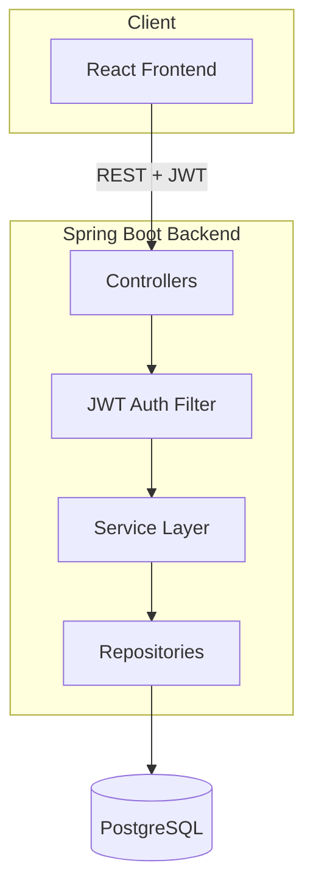

# ✈️ Airline Booking System

[](https://github.com/ayushadhikari15/airline-booking-system/actions/workflows/backend-ci.yml)
[](./LICENSE)

A full-stack flight booking platform with JWT authentication and
**concurrency-safe seat reservation** — two users can never book the same
seat, even under simultaneous requests.

## Tech Stack

| Layer | Technology |
|---|---|
| Backend | Spring Boot 4.1.1, Java 21, Spring Security, Spring Data JPA |
| Database | PostgreSQL |
| Frontend | React (Vite), React Router, Axios |
| Auth | JWT (stateless) |
| Infra | Docker, Docker Compose |
| CI | GitHub Actions |

## Architecture



Layered monolith: `Controller → Service → Repository`, with a stateless JWT
filter validating every request before it reaches business logic. See
[`airlinebooking/BUILD_GUIDE.md`](./airlinebooking/BUILD_GUIDE.md) for the
full build sequence and design rationale.

## The interesting part: concurrency-safe booking

Booking a seat locks its database row with `PESSIMISTIC_WRITE` inside a
`@Transactional` method:

```java
@Lock(LockModeType.PESSIMISTIC_WRITE)
@Query("SELECT s FROM Seat s WHERE s.id = :id")
Optional<Seat> findByIdForUpdate(@Param("id") Long id);
```

If two requests target the same seat at the same time, the second waits for
the first transaction to commit, then sees the seat as already `BOOKED` and
fails cleanly with `409 Conflict` — instead of both succeeding and
double-booking the seat. Verified manually by firing concurrent requests at
the same seat from two clients simultaneously.

## Features

- JWT-based authentication with role-based access (`USER` / `ADMIN`)
- Flight search by source, destination, and date
- Real-time seat availability with race-condition-safe booking
- Booking cancellation with seat release
- Centralized exception handling — domain errors map to correct HTTP status
  codes (`404`, `409`, `401`, `403`) instead of raw stack traces
- Fully containerized: backend, frontend, and PostgreSQL each run in their
  own Docker container, orchestrated via Docker Compose

## Running locally

```bash
git clone https://github.com/ayushadhikari15/airline-booking-system.git
cd airline-booking-system
cp .env.example .env   # fill in your own DB_PASSWORD and JWT_SECRET
docker compose up --build
```

- Backend: `http://localhost:8080`
- Frontend: `http://localhost:5173`

## API Reference

| Method | Path | Auth |
|---|---|---|
| POST | `/api/auth/register` | none |
| POST | `/api/auth/login` | none |
| GET | `/api/flights/search` | user |
| GET | `/api/flights/{id}/seats` | user |
| POST | `/api/admin/flights` | admin |
| POST | `/api/bookings` | user |
| GET | `/api/bookings/my` | user |
| DELETE | `/api/bookings/{id}` | user |

## License

[MIT](./LICENSE)
